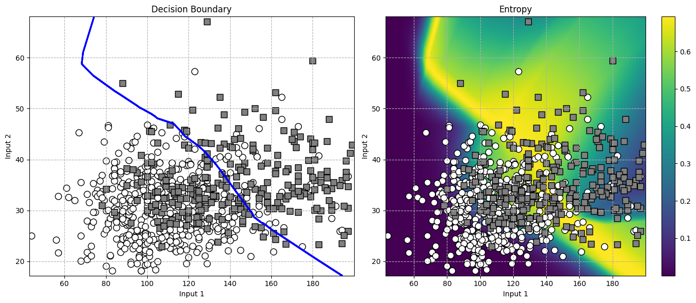
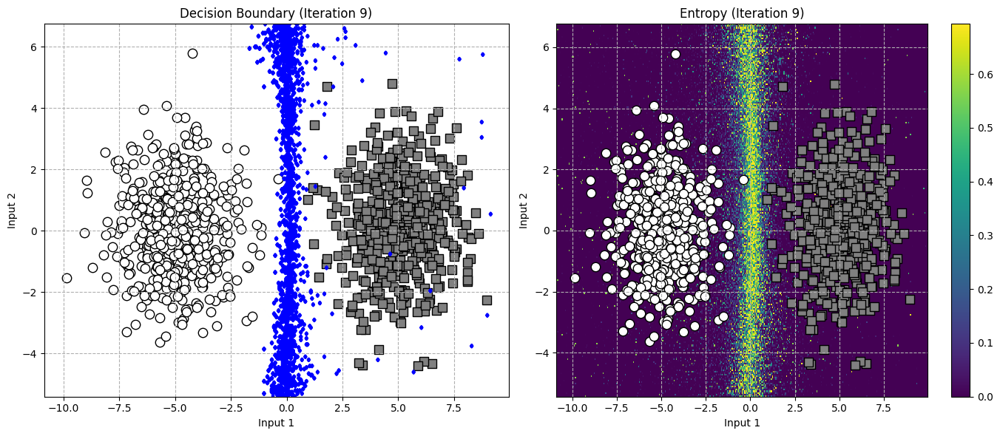
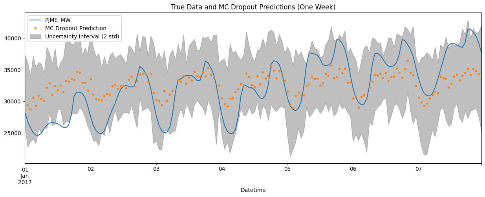

# Bayesian Statistical Analysis for DL : Exploring Diabetes and Energy Consumption Data  

## Overview  
This project applies Bayesian methods to analyze two datasets: the **National Institute of Diabetes and Digestive and Kidney Diseases’ (NIDDK) diabetes dataset** and the **PJM Interconnection’s hourly energy consumption dataset**. Inspired by the 2017 paper *"Deep Learning: A Bayesian Perspective"*, we implement Bayesian approaches to showcase their strengths, challenges, and the potential for broader applications in statistical analysis. 

## Authors  
   ▪️ **`Zakarya Elmimouni`** – (ENSAE) 
   ▪️ **`Ahmed Khairaldin`** – (ENSAE) 
   ▪️ **`Amine Razig`** – (ENSAE) 

## Table of Contents  
1. [Objective](#objective)  
2. [Datasets](#Datasets )  
3. [Techniques and Methods](#techniques-and-methods-in-the-report)  
4. [How to Run the Project](#how-to-run-the-project)  
5. [Requirements](#requirements)  

## Objective  
The primary objective of this project is to demonstrate the advantages and challenges of Bayesian methods when applied to real-world data. We aim to:  
1. Explore Bayesian methods for analyzing the diabetes and energy consumption datasets.  
2. Develop a simulation study to evaluate the methods' robustness and effectiveness.  
3. Discuss advancements in Bayesian techniques since the publication of the paper.  

## 📊 Datasets  

1. **National Institute of Diabetes and Digestive and Kidney Diseases (NIDDK) Diabetes Dataset**  
   - **Description**: Medical data on factors influencing diabetes progression, including age, BMI, blood pressure, and glucose levels.  
   - **Purpose**: Analyze how Bayesian methods can provide insights into the relationships between predictors and the likelihood of diabetes.  

2. **PJM Interconnection Hourly Energy Consumption Dataset**  
   - **Description**: Time series data capturing hourly energy consumption for regional transmission operators.  
   - **Purpose**: Explore Bayesian approaches for modeling and predicting energy usage patterns over time.  

## Techniques and Methods  treated in the report : 

1. **MLP**  
2. **Markov Chain Monte Carlo**
3. **Dropout Approximation**  
4. **Bayesian Neural Networks**  
   - Inspired by the original paper, implemented for exploring complex relationships in the data.  


<div style="display: flex; justify-content: space-between;">
  <figure style="width: 45%;">
    
    <figcaption>Diabetes Data</figcaption>
  </figure>
  
  <figure style="width: 45%;">
    
    <figcaption>Simulated Data</figcaption>
  </figure>
</div>

<br />

<figure style="width: 45%;">
  
  <figcaption>Energy Consumption Data</figcaption>
</figure>

## How to Run the Project  

### Step 1: Clone the Repository  
```bash  
git clone https://github.com/ahmedkakiAK/Bayesian_stats_project.git
cd Bayesian_stats_project 
```  

### Step 2: Install Dependencies  
Ensure **Python 3.8+** is installed, then run:  
```bash  
pip install -r requirements.txt  
```  

### Step 3: Explore the Data and Methods  

#### Model Implementation  
- Bayesian models are implemented in separate files 

Run these notebooks individually to explore specific methods.  

- `diabetes_exp.ipynb` Notebook for experiments with **Diabetes data**. 
- `synth_exp.ipynb` Notebook for experiments with **synthetics data**. 
- `PMJE_exp.ipynb` Notebook for experiments with **Temporal Energy consumption data**. 


### Step 4: Results and Visualizations  
- Key results, (predictive performance) are visualized in each method-specific notebook.  

## Requirements  
- **Python 3.8+**  
- Libraries:  
  - `numpy`  
  - `pandas`  
  - `matplotlib`  
  - `seaborn`  
  - `scipy`
  - `sklearn`
  - `tensorflow` (for Bayesian Neural Networks)  
- **Optional**: GPU for accelerated computation with neural models.  

## References
- Vadim Sokolov Nicholas Polson. Deep learning: A bayesian perspective. 12:1275–1304, 2017

- Zoubin Ghahramani Yarin Gal. Dropout as a bayesian approximation: Representing model uncer-
tainty in deep learning. 2016
